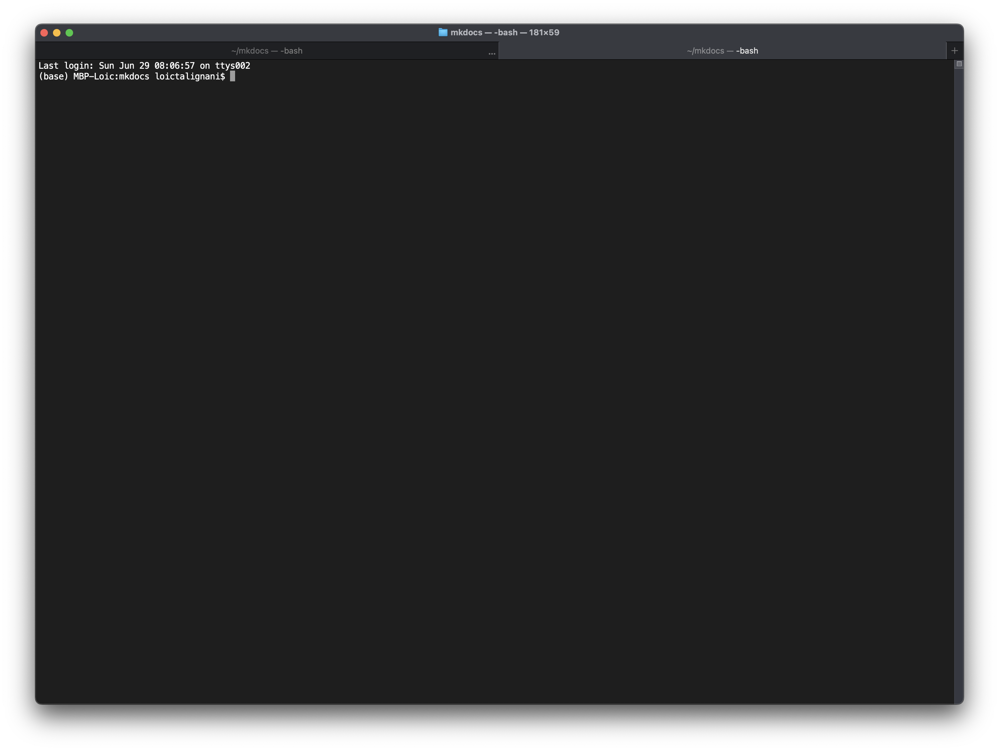

# Logging into a Cluster (ssh)

**SLURM** (*Simple Linux Utility for Resource Management*) is a workload manager used on many high-performance computing (HPC) clusters. It helps schedule jobs on compute nodes and manage resources efficiently.


## Access

To access the cluster, you need to use a terminal on Linux / macOS.

{ style="display: block; margin: auto;" }


On Windows, you can use a terminal emulator like [MobaXterm](https://mobaxterm.mobatek.net). 
  
  
To access the cluster, you typically use a secure shell (ssh) from your local machine. Open a new shell and enter the following command:

```bash title="Connexion" linenums="1" hl_lines="2"
# Function to add two numbers
ssh username@cluster.address.edu

# Example usage
ssh student1@core.cluster.france-bioinformatique.fr
```
  
Replace username with your cluster *login name* and *cluster.address.edu* with the actual domain or IP of the cluster. You will be prompted to enter your **password**, which is usually provided by the cluster administrator.
</br>
</br>

!!! tip "Extra Tip for Linux / macOS users"
    If you need to connect to the cluster frequently, it may be useful to save the address in an alias, stored in the *.bashrc* file. All you have to do is enter the alias followed by the enter key to access the cluster directly:

```bash
echo "alias ifb='ssh student1@core.cluster.france-bioinformatique.fr'" >> ~/.bashrc
source ~/.bashrc
```
</br>
</br>
Once connected, you’ll land in your home directory on the cluster’s head node or login node. This is where you can prepare your job scripts, transfer files, and monitor jobs. 


## Prepare a project directory 

Some cluster managers propose limited use of the home directory and prefer data to be hosted in a dedicated project directory. In this case, you need to request the creation of this directory and move into it from the home directory when it is ready.

### Organizing data in the project directory
1. Prepare a `code/` directory in the project directory: `mkdir -p code`. This directory will be used to store scripts.  
2. Prepare a `data/` directory in the project directory: `mkdir -p data`. This directory will be used to store data.  
3. Prepare a `results/` directory in the project directory: `mkdir -p results` This directory will be used to store results.  


###  Recommended Project Structure

```
my_project/
├── code/                
│   ├── myscript.R       
│   └── setup_env.R      
├── data/                
│   └── data.csv         
├── results/             
├── .gitignore          
└── README.md           
```  
