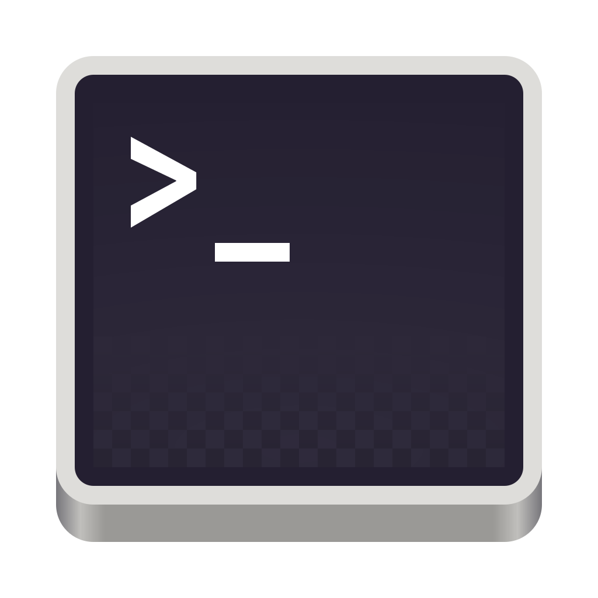

# Logging into a High-Performance Computing (HPC) Cluster (ssh)

<h2 class="no-toc">Table of Content</h2>

[TOC]

**High-Performance Computing (HPC) clusters** have become indispensable infrastructure in computational biology, addressing the exponential growth in biological data and the computational complexity of modern bioinformatics analyses. As genomic datasets reach terabyte scales and molecular simulations require millions of calculations, traditional desktop computers simply cannot handle the computational demands of contemporary biological research.

HPC clusters provide **massive parallel processing power** by connecting hundreds or thousands of processors, enabling researchers to tackle computationally intensive tasks such as whole-genome assembly, comparative genomics, protein structure prediction, and population genetics studies. Tasks that would take weeks or months on a single computer can be completed in hours or days on a well-configured cluster.

Beyond raw computing power, clusters offer **specialized resources** including high-memory nodes for memory-intensive applications, GPU acceleration for machine learning algorithms, and high-speed interconnects for data-intensive workflows. The **scalability** of cluster computing allows researchers to adjust computational resources based on project requirements, from small pilot studies to large-scale genomic consortiums.

Most importantly, HPC clusters enable **collaborative science** by providing shared computing environments where multiple researchers can access the same tools, databases, and computational resources. This infrastructure has become essential for advancing fields like precision medicine, evolutionary biology, and systems biology, where computational bottlenecks often limit scientific discovery.

In modern computational biology, access to HPC resources is no longer a luxury—it's a **fundamental requirement** for competitive research.

## Access

### The Terminal
The **terminal** serves as a fundamental tool in computational biology, providing researchers with direct access to powerful command-line interfaces essential for bioinformatics workflows. Unlike graphical applications, the terminal enables efficient processing of large biological datasets that are common in genomics, proteomics, and structural biology.

Computational biologists rely on the terminal to execute specialized software like **BLAST** for sequence alignment, **samtools** for genomic data manipulation, and **R** or **Python** scripts for statistical analysis. The command-line environment excels at batch processing multiple files, automating repetitive tasks through scripting, and chaining together different bioinformatics tools via pipes and redirections.

For **computationally intensive tasks** such as whole-genome sequencing analysis, protein folding simulations, or large-scale phylogenetic reconstructions, using a **HPC cluster becomes essential**. These high-performance computing resources are accessed exclusively through the terminal via **SSH connections**, making command-line proficiency not just helpful but absolutely critical for modern computational biology.

Linux and macOS have a terminal installed by default.
<div class="image-row">
  <div class="image-item">
    
    <br><em>macOS Terminal Icon</em>
  </div>
  <div class="image-item">
    
    <br><em>Ubuntu 22.04 Terminal Icon</em>
  </div>
</div>

{ style="display: block; margin: auto;" }
*macOS Terminal*

On Windows, you have to install a terminal emulator like [MobaXterm](https://mobaxterm.mobatek.net). 
  

### The prompt
The shell prompt is the command prompt that appears in the terminal, indicating that the system is waiting for input from the user.
The `$` symbol at the end of the prompt is a Unix/Linux convention which indicates that you are logged in as a normal user (non-administrator). On the other hand, the `#` symbol indicates that you are logged in as root.
```bash linenums="1"
user@hostname:~$ ls          # User
root@hostname:~# systemctl   # Administrator (root)
```
The prompt can contain information such as the user name, machine name and current directory, and ends with $ or # depending on privileges. This visual distinction makes it possible to quickly identify the level of access before executing potentially dangerous commands.

### Connection with ssh

To log on to the cluster, you typically use a secure shell (ssh) from your local machine. Open a new shell and enter the following command:

```bash title="Connexion" linenums="1" hl_lines="2"
# Function to add two numbers
$ ssh username@cluster.address.edu
```
  
Replace username with your cluster *login name* and *cluster.address.edu* with the actual domain or IP of the cluster. You will be prompted to enter your **password**, which is usually provided by the cluster administrator.
</br>
</br>

!!! tip "Extra Tip for Linux / macOS users"
    If you need to connect to the cluster frequently, it may be useful to save the address in an alias, stored in the *.bashrc* file.  
    The .bashrc file is a configuration script that runs automatically every time you open a new interactive Bash shell session on Unix-like systems. It contains custom settings, aliases, functions, and environment variables that personalize your command-line experience and define how your shell behaves.  
    All you have to do is enter the alias followed by the enter key to access the cluster directly:
    ```bash linenums="1"
    $ echo "alias cluster='ssh username@cluster.address.edu'" >> ~/.bashrc
    $ source ~/.bashrc
    ```
    The next time you want to connect to the cluster, simply type the alias name followed by enter:
    ```bash linenums="1"
    $ cluster
    ```

</br>
Once connected, you’ll land in your home directory (`$HOME` | `~` | `/home/username/`) on the cluster’s head node or login node. This is where you can prepare your job scripts, transfer files, and monitor jobs. 


## Request your project directory 

Some cluster managers propose limited use of the home directory and prefer data to be hosted in a dedicated project directory. In this case, the *Principal Investigator* (PI) applies to the cluster administrator for a project directory and space (in TeraBytes).

## Organising data in the project directory
Once the project file has been created, it is essential to get the project off to a good start, by deciding on an organisation that must be respected over time.    
Choose a structure that works well for you and stick to it as much as possible. Below is a suggested way of organising the code:

```
my_project/
├── Cluster_logs/          		
├── code/          		        # Script directory
│   └── myscript.sh
│   └── setup_env.R             
├── data/          		        # Raw data directory
│   └── data.csv
├── results/     		        # Analysis results directory
├── tests/          		    # Temporary test code
│   └── my_temporary_script.R
├── tmp/                        
├── .gitignore 
└── README.md
```

**Mandatory**:  
- `README.md` file. This file is arguably **the most important** file you’ll create in your project. It should provide a clear overview of the code’s purpose, including:
    - The goal of the project
    - Set-up and execution instructions
    - If no separate documents exist (e.g., architecture diagram or system maintenance guide), a high-level explanation of how the code is structured and works

!!! warning "The `README.md` is not the place to describe individual functions in detail"  
     Keep it high-level and accessible.  
     The `README.md` is a living document. As your code evolves, make sure to keep the documentation up to date.  
     Don’t postpone writing it until the end of the project — by then, you’ll likely be racing against deadlines and already thinking about your next project.  
     Start documenting early. It will save you time and effort later. 

**File / directories to be created:**  
- `Cluster_logs` directory. It contains logs files redirected from standard output (`.out`) and standard error (`.err`).
- `code/` directory. It contains scripts, in the form of `.R`, `.sh`, `.py` files.  
- `data/` directory. It contains data to be analyzed (.csv, .vcf...).  
- `results/` directory. It contains outputs. It is recommended to add subdirectories in this directory.  
- `tests/` directory. Code tests should go in here.  
- `tmp/`directory. It is used to store temporary files generated by the programs or workflows within this project. It serves as a local alternative to the system’s default $TMPDIR, which is often saturated or unreliable on shared cluster environments.  
- `.gitignore`. In this file, you add everything you do not want ending up in your remote repository. As a minimum, add `tmp/` file in there.  


To create directories: `mkdir -p Cluster_logs data code results tests tmp` 
