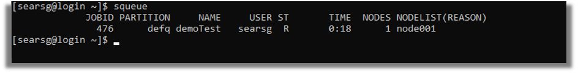
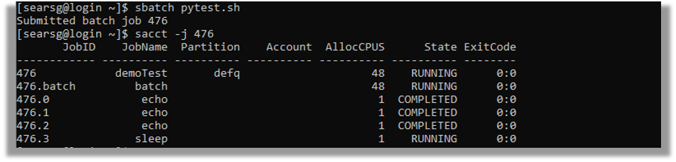

# Monitoring and Managing SLURM Jobs

<h2 class="no-toc">Table of Content</h2>

[TOC]

Once your job is submitted, you can check his status, inspect resource usage, or cancel it using the following commands:

## View partitions and node status

```bash
sinfo
```
Displays the status of available partitions and nodes (availability, max time, etc.). 

## Check job queue

```bash
squeue
```

Shows all jobs currently pending or running.



```bash
squeue -u <username>
```
Preferable. Displays jobs submitted by a specific user. Example:

```bash
squeue -u student1
```

## Show job details

```bash
scontrol show job <job_id>
```

Displays detailed information about a specific job (resources requested, job state, etc.).

## Cancel a job

```bash
scancel <job_id>
```

Cancels the specified job.

```bash
scancel -u <username>
```

Cancels all jobs submitted by the given user.

## Check resource usage after job completion
Some clusters enable job accounting with:

```bash
sacct -j <job_id>
```
Displays job statistics such as runtime, memory usage, and CPU efficiency once the job has finished.




Some clusters use another command available after loading a module:
```bash
module load reportseff
reportseff <job_id>
```
