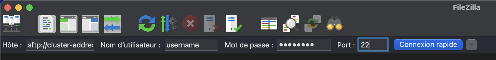
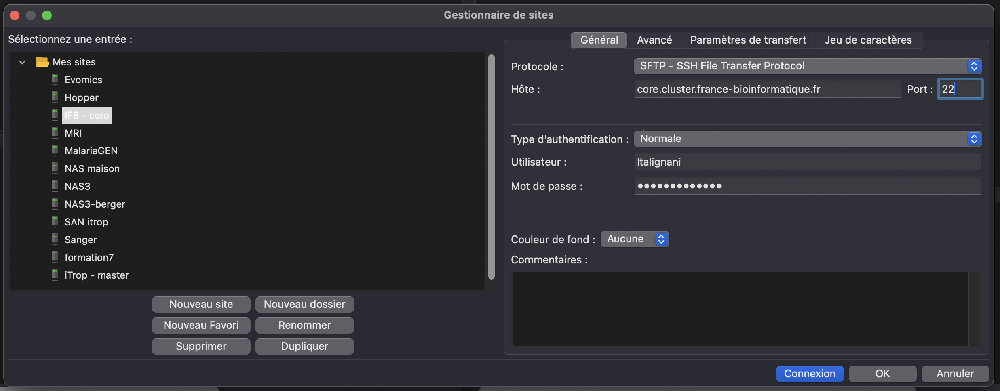
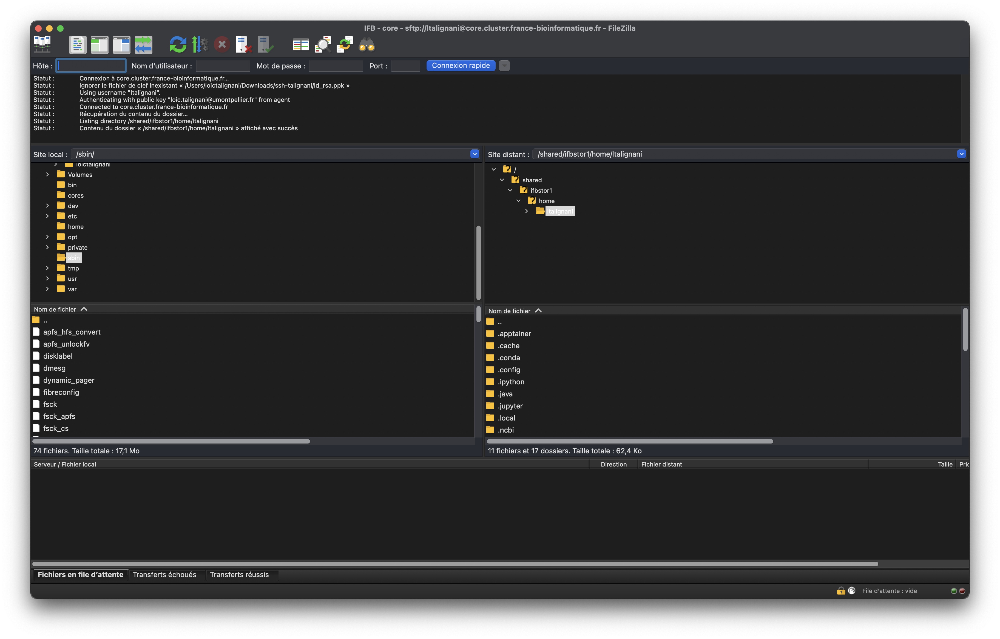

# Transfering Files Using FileZilla and SFTP

<h2 class="no-toc">Table of Content</h2>

[TOC]

This guide explains how to transfer files from your local computer to a computing cluster using FileZilla and the SFTP protocol (SSH File Transfer Protocol).

## Prerequisites

Before getting started, make sure you have:

- **FileZilla Client** installed on your computer
- **Connection credentials** for the cluster (username, password, or SSH key)
- **Server address** of the computing cluster
- **Connection port** (typically 22 for SFTP)

## Installing FileZilla

### Windows

1. Download FileZilla Client from the official website: [https://filezilla-project.org/](https://filezilla-project.org/)
2. Run the installer and follow the installation instructions
3. Launch FileZilla from the Start menu

### Linux (Ubuntu/Debian)

```bash
sudo apt update
sudo apt install filezilla
```

### Linux (CentOS/RHEL/Fedora)

```bash
# CentOS/RHEL
sudo yum install filezilla

# Fedora
sudo dnf install filezilla
```

### macOS

1. Download FileZilla Client from the official website
2. Open the downloaded `.dmg` file
3. Drag FileZilla to the Applications folder
4. Launch FileZilla from Launchpad

## Configuring SFTP Connection

### Method 1: Quick Connect

1. Open FileZilla
2. In the quick connect bar at the top, enter:
   - **Host**: `sftp://cluster-address.example.com`
   - **Username**: your username
   - **Password**: your password
   - **Port**: 22 (or the port specified by your administrator)
3. Click **Quickconnect**

{ style="display: block; margin: auto;" }

### Method 2: Site Manager (recommended)

1. Go to **File** → **Site Manager**
2. Click **New Site**
3. Give your connection a name (e.g., "Computing Cluster")
4. Configure the settings:
   - **Protocol**: SFTP - SSH File Transfer Protocol
   - **Host**: cluster-address.example.com
   - **Port**: 22
   - **Logon Type**: 
     - **Normal** (username + password)
     - **Key file** (if using SSH private key)
   - **User**: your username
   - **Password**: your password (if using normal authentication)

5. Click **Connect**

{ style="display: block; margin: auto;" }

## SSH Key Authentication

If your cluster uses SSH key authentication:

1. In the Site Manager, select **Key file** as the logon type
2. Click **Browse** next to "Key file"
3. Select your SSH private key (typically `~/.ssh/id_rsa` or `~/.ssh/id_ed25519`)
4. If your key is not in PPK format, FileZilla will offer to convert it automatically

## FileZilla Interface

Once connected, the FileZilla interface is divided into several sections:

- **Local panel** (left): files and folders on your computer
- **Remote panel** (right): files and folders on the cluster
- **Message window** (top): connection and transfer status
- **Transfer queue** (bottom): transfer queue

{ style="display: block; margin: auto;" }

## Transferring Files

### Simple Transfer

1. **Navigate** through your local folders (left panel)
2. **Navigate** to the destination directory on the cluster (right panel)
3. **Drag and drop** files from the local panel to the remote panel
4. Alternatively, **right-click** on a file → **Upload**

### Folder Transfer

To transfer an entire folder:

1. Select the folder in the local panel
2. Drag it to the remote panel
3. FileZilla will automatically transfer all contents

### Monitoring Transfers

The transfer queue window allows you to:

- View progress of ongoing transfers
- Pause or cancel transfers
- Resume interrupted transfers

## Best Practices

### Security

- **Always use SFTP** instead of FTP for secure connections
- **Verify the server fingerprint** on first connection
- **Use SSH keys** instead of passwords when possible
- **Close the connection** after use

### Performance

- **Adjust the number of simultaneous connections** in Edit → Settings → Transfers
- **Use compression** for large text files
- **Avoid transferring many small files**; prefer archives

### Organization

- **Create profiles** in the Site Manager for different clusters
- **Use bookmarks** to mark frequently used directories
- **Synchronize directories** with the synchronization feature

## Common Troubleshooting

### Connection Failure

- Verify the server address and port
- Confirm your credentials
- Check that SSH service is active on the cluster
- Contact the system administrator if necessary

### Slow Transfers

- Check your internet connection
- Adjust the number of simultaneous connections
- Use compression for appropriate files

### Permission Errors

- Verify that you have write permissions in the destination directory
- Contact the administrator to adjust permissions if necessary

## Alternative SFTP Commands

For advanced users, here are some command-line SFTP commands:

```bash
# SFTP connection
sftp username@cluster-address.example.com

# Navigation
ls                    # List remote files
lls                   # List local files
cd /path/to/directory # Change remote directory
lcd /local/path       # Change local directory

# Transfer
put localfile.txt     # Upload a local file
get remotefile.txt    # Download a remote file
put -r local_folder   # Upload a folder (recursive)
get -r remote_folder  # Download a folder (recursive)

# Exit
quit
```

## Additional Resources

- [Official FileZilla Documentation](https://wiki.filezilla-project.org/)
- [SSH and SFTP Guide](https://www.ssh.com/academy/ssh/sftp)
- Contact your system administrator for specific configurations